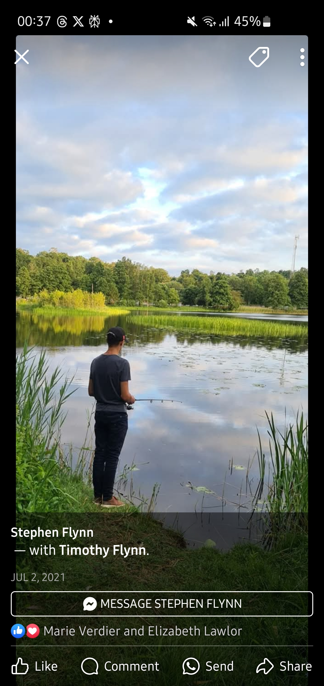

# 👋 Hej! I'm Tim! 😁

## 🇸🇪 Swedish developer tinkerin' maninkerin' with code

> Swedish guy doing IT stuff sometimes. Please reach out if you feel inclined!

## 🛠️ What I'm up to

- Developing tools for Android reverse-engineering
- Building utilities for Tasker
- Working on personal servers
- Experimenting with Gemini API

## 💻 Tech I enjoy

```
Python | FastAPI | NextJS |
```

## 🌟 Featured Projects

- **BetterSchema**: Spiced up our old timetable viewer for school 😜
- **REVDROID**: Various tools and notes on reverse-engineering Android apps
- **Tasker**: A collection of Profiles, Tasks, Scenes, Guides and other tools for Tasker
- **CircleSchema**: Visualisera lektioner som en cirkel
- **SchemaAPI**: Python-based API integration

## 🔮 Fun Facts

- I enjoy building tools that make everyday tasks more efficient
- Sometimes my repositories are just "I JUST want the README" 😄


## 📫 Connect with me

Feel free to explore my repositories or reach out if you feel inclined!

<details>
<summary>surprise 👀👀👀</summary>

</details>

---

*tinker (verb): attempt to repair or improve something in a casual or desultory way*